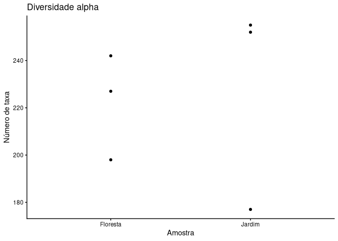
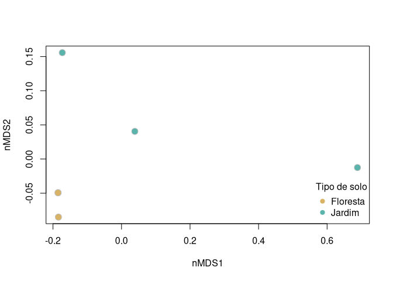
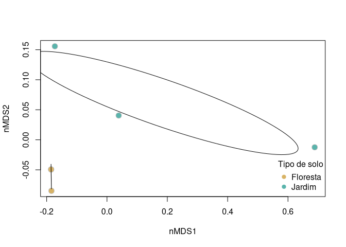

# Introdução

Este protocolo tem como objetivo ilustrar os passos principais para uma
análise geral dos microbiomas obtidos com a tecnologia de sequenciação
minION.

**Objetivos**

1.  Perceber como se podem processar as raw reads.
2.  Discutir os resultados de sequenciação.
3.  Aplicar uma análise ecológica simples.
4.  Discutir os resultados ecológicos.
5.  Discutir a qualidade dos resultados.

## Processamento de *raw reads* (upstream)

O processamento de raw reads pode ser feito com o protocolo ws-16 da
epi2me, que foi construído para este tipo de dados. Para o efeito, basta
usar um único comando com o software **nextflow**.

Link para
workflow:<https://epi2me.nanoporetech.com/epi2me-docs/workflows/wf-16s/>

Notas:

-   Não vamos correr este comando na aula, porque o processo de
    instalação varia entre sistemas operativos e pode ser demorado.

-   Na pasta **nextflow_reports** vão encontrar os resultados para as
    vossas amostras.

-   Na pasta **fastq_pass/barcodes** vão encontrar os resultados de
    sequenciação.

**Opção standard**

Para processar as raw reads com parâmetros *default*:

``` bash
sudo nextflow run epi2me-labs/wf-16s \
      --fastq 'fastq_pass/barcodes/' \
      --minimap2_by_reference   \ 
      -profile standard
```

**Questão:** Que parâmetros podemos alternar e testar?

**Opção final**

Vamos cortar as reads que têm tamanhos fora do esperado e diminuir o
threshold mínimo de identidade.

``` bash
sudo nextflow run epi2me-labs/wf-16s \
      --fastq 'fastq_pass/barcodes/'  \
      --minimap2_by_reference \
      --threads 10 \
      --min_len 1500 \ 
      --max_len 1700 \ 
      --min_percent_identity 90 \ 
      -profile standard
```

# Análise dos microbiomas

Para a análise *downstream* dos microbiomas, vamos usar a linguagem de
programação R e o RStudio.

Instalar R: <https://www.r-project.org/>

Instalar Rstudio: <https://posit.co/download/rstudio-desktop/>

# Preparar a sessão de R

Por uma questão de organização, devem criar um projeto no RStudio na
mesma pasta onde estão a realizar este trabalho.

**Pacotes necessários**

``` r
library(dplyr) 
```

    ## 
    ## Attaching package: 'dplyr'

    ## The following objects are masked from 'package:stats':
    ## 
    ##     filter, lag

    ## The following objects are masked from 'package:base':
    ## 
    ##     intersect, setdiff, setequal, union

``` r
library(tidyr)
library(stringr)
library(ggplot2)
library(vegan)
```

    ## Loading required package: permute

``` r
# se for preciso instalar:
#install.packages("NameOfPackage")
```

## Importação de dados

O primeiro passo em análise de dados é a importação e verificação dos
dados. Neste caso, os dados são a tabela com a abundância dos
microorganismos identificados e a tabela com os metadados, ou seja, a
informação sobre as amostras. Os metadados são importantes para
conseguirmos interpretar os resultados.

``` r
# Importar metadados
metadata <- read.csv("./data/metadata.csv")
# Ver a tabela de metadados
View(metadata)

# Importar tabelas de abundância
abundance <- read.table("./data/abundance_table_genus.tsv", sep = "\t", header = TRUE)
# Ver a tabela de abundância
View(abundance)

# Não precisamos da coluna com os valores totais
abundance <- abundance %>% select(-total)
```

**Questão:** Os metadados estão armazenados corretamente?

``` r
# Verificar estrutura dos metadados
str(metadata)
```

    ## 'data.frame':    8 obs. of  7 variables:
    ##  $ Grupo    : chr  "Grupo 1" "Grupo 2" "Grupo 3" "Grupo 4" ...
    ##  $ Local    : chr  "Jardim Botânico do Porto" "Jardim Botânico do Porto" "Jardim Botânico do Porto" "Jardim Botânico do Porto" ...
    ##  $ Solo     : chr  "Solo Floresta 1" "Solo Floresta 2" "Solo Floresta 3" "Solo Jardim 1" ...
    ##  $ Latitude : num  41.2 41.2 41.2 41.2 41.2 ...
    ##  $ Longitude: num  8.64 8.64 8.64 8.64 8.64 ...
    ##  $ ID       : chr  "SF1" "SF2" "SF3" "SJ1" ...
    ##  $ Barcode  : chr  "barcode01" "barcode02" "barcode03" "barcode04" ...

``` r
# verificar estrutura da tabela de abundância
str(abundance)
```

    ## 'data.frame':    690 obs. of  8 variables:
    ##  $ tax      : chr  "Bacteria;Pseudomonadati;Pseudomonadota;Gammaproteobacteria;Enterobacterales;Yersiniaceae;Rahnella" "Unclassified;Unknown;Unknown;Unknown;Unknown;Unknown;Unknown" "Bacteria;Pseudomonadati;Pseudomonadota;Gammaproteobacteria;Enterobacterales;Yersiniaceae;Ewingella" "Bacteria;Pseudomonadati;Pseudomonadota;Alphaproteobacteria;Hyphomicrobiales;Nitrobacteraceae;Bradyrhizobium" ...
    ##  $ barcode01: num  0 760 0 93 14 146 137 40 107 55 ...
    ##  $ barcode02: num  0 714 0 152 37 145 139 89 101 79 ...
    ##  $ barcode03: num  0 1099 0 219 41 ...
    ##  $ barcode04: num  0 557 0 241 297 11 17 176 73 142 ...
    ##  $ barcode06: num  0 831 0 98 298 135 137 103 56 22 ...
    ##  $ barcode07: num  0 730 0 81 48 116 26 86 35 102 ...
    ##  $ barcode08: num  5129 30 2046 0 0 ...

### Limpeza de dados

Com base na análise anterior, vamos corrigir os metadados:

``` r
# Mudar colunas para formato correto
metadata_clean <- metadata %>%
  mutate(Grupo = as.factor(Grupo),
         Local = as.factor(Local),
         Solo = as.factor(Solo),
         Latitude = as.double(Latitude),
         Longitude = as.double(Longitude),
         ID = as.factor(ID),
         Barcode = as.factor(Barcode))

# Corrigir o tipo de solo
metadata_clean <- metadata_clean %>% 
  mutate(Solo = case_when(str_detect(Solo, "Solo Floresta") ~ "Floresta",
                          str_detect(Solo, "Solo Jardim") ~ "Jardim",
                          TRUE ~ NA))

# Remover barcode05
metadata_clean <- metadata_clean %>% 
  filter(Barcode != "barcode05")
# Guardar o nome dos barcodes
barcodes <- metadata_clean$Barcode
```

## Análise exploratória inicial

Vamos começar por analisar a variação da profundidade de sequenciação.

``` r
# calcular o número total de reads
total_reads <- data.frame(Total = colSums(abundance[,2:8]),
                          Barcode = metadata_clean$Barcode)
# Ver o número total de reads por amostra
total_reads %>% 
  ggplot(aes(x = Barcode, y = Total)) + 
  geom_col() + 
  theme_classic() + 
  labs(title = "Número de reads por amostra")
```


**Questão:** Justifica-se aplicar rarefação?

``` r
# Possíveis valores para rarefação
total_reads %>% 
  ggplot(aes(x = Barcode, y = Total)) + 
  geom_col() + 
  theme_classic() + 
  labs(title = "Número de reads por amostra",
       y = "Número de reads") + 
  geom_hline(yintercept = c(min(total_reads$Total), 4000, 8000), colour = c("red", "black", "black"))
```


### Opcional – aplicar rarefação dos dados

Para aplicar rarefação, podemos usar a package “vegan”, mas precisamos
de transformar a data.frame numa matrix, com os grupos taxonómicos nas
colunas e os barcodes nas linhas.

``` r
# Transformar tabela em matriz com taxa nas colunas
abundance_matrix <- t(abundance[, 2:8])
colnames(abundance_matrix) <- abundance[, 1]
# Aplicar rarefação
abundance_rarefied <- rrarefy(abundance_matrix, sample = 3700)
#
View(abundance_rarefied)
```

Podemos verificar o que acontece depois da rarefação:

``` r
# calcular total
total_rarefied <- data.frame(Total = rowSums(abundance_rarefied),
                             Barcode = barcodes) 
# visualizar
total_rarefied %>% 
  ggplot(aes(x = Barcode, y = Total)) + 
  geom_col() +  
  theme_classic() + 
  labs(title = "Número de reads depois de aplicar rarefação")
```


Nota: para as próximas análises vamos usar os dados **sem** rarefação.

## Organização das tabelas

Para ser mais fácil realizar as análises seguintes, vamos formatar os
dados de uma maneira mais adequada.De seguida, vamos unir as diferentes
fontes de informação, ou seja, a tabela de abundância e taxonomia com a
tabela de metadados.

1.  Mais especificamente, transformar as tabelas de abundância para
    formato longo (em vez de *wide*).

Nota: tabela em formato longo implica que cada variável corresponde a
uma coluna.

``` r
#
abundance_long <- abundance %>% 
  pivot_longer(cols = all_of(barcodes), 
               names_to = "Barcode", 
               values_to = "Abundance")
# Inspectionar a tabela em formato longo
View(abundance_long)
```

1.  Juntar os metadados

**Questão:** Como podemos unir as tabelas?

``` r
# União de tabelas
full_table <- abundance_long %>% 
  left_join(metadata_clean, by = "Barcode")

# Inspecionar nova tabela
View(full_table)
```

# Análise de diversidade

A análise de diversidade vai consistir no seguinte:

1.  Diversidade alpha
2.  Diversidade beta
3.  Taxonomia

## Limpeza dos dados

Nesta fase, temos as tabelas prontas a seres usadas. No entanto, ainda
podemos aplicar mais passos de limpeza para otimizar as análises.
Geralmente, estes passos dependem do desenho experimental, métodos, etc.
Neste caso concreto, podemos ser mais exigentes com a taxonomia.

Passos a aplicar:

1.  Remoção de singletons;
2.  Remoção de taxa que não foram classificados

**Questão:** Que outras opções podemos considerar?

``` r
full_table <- full_table %>%
  filter(Abundance > 1) %>% # Remover singletons
  filter(!str_detect(tax, "Unclassified")) # Remover não classificados
```

## Diversidade Alpha

Vamos comparar a diversidade entre amostras através de duas métricas:

1.  Riqueza de espécies
2.  Shannon

``` r
# Calcular métricas de diversidade
diversity <- full_table %>% 
  group_by(ID, Grupo, Local, Latitude, Longitude, Solo) %>% 
  summarise(richness = specnumber(Abundance),
            shannon = diversity(Abundance, index = "shannon"))
```

    ## `summarise()` has grouped output by 'ID', 'Grupo', 'Local', 'Latitude',
    ## 'Longitude'. You can override using the `.groups` argument.

Nota: Para efeitos de comparação das amostras ambientais, não precisamos
dos valores da mock community.

Agora, podemos comparar a diversidade entre os dois tipos de solo.

``` r
# Gráfico de colunas - riqueza de taxa
diversity %>% 
  filter(ID != "M1") %>% 
  ggplot(aes(x = ID, y = richness, fill = Solo)) +
  geom_col() + 
  theme_classic() + 
  labs(title = "Diversidade alpha",
       y = "Número de taxa",
       x = "Amostra") + 
  scale_fill_manual(values = c("#d8b365", "#5ab4ac"))
```


``` r
# Gráfico de colunas - índice de shannon
diversity %>% 
  filter(ID != "M1") %>% 
  ggplot(aes(x = ID, y = shannon, fill = Solo)) +
  geom_col() + 
  theme_classic() + 
  labs(title = "Diversidade alpha",
       y = "Número de taxa",
       x = "Amostra") + 
  scale_fill_manual(values = c("#d8b365", "#5ab4ac"))
```


``` r
# Gráfico de pontos - riqueza de espécies
diversity %>% 
  filter(ID != "M1") %>% 
  ggplot(aes(x = Solo, y = richness)) +
  geom_point() + 
  theme_classic() + 
  labs(title = "Diversidade alpha",
       y = "Número de taxa",
       x = "Amostra") 
```


``` r
# Gráfico de pontos - índice de shannon
diversity %>% 
  filter(ID != "M1") %>% 
  ggplot(aes(x = Solo, y = shannon)) +
  geom_point() + 
  theme_classic() + 
  labs(title = "Diversidade alpha",
       y = "Shannon",
       x = "Amostra") 
```



### Extra - como juntar as duas métricas num só gráfico?

``` r
# transformar em formato longo (1 coluna por variável)
diversity_long <- diversity %>% 
  filter(ID != "M1") %>% 
  pivot_longer(cols = c("richness", "shannon"),
               values_to = "Valor",
               names_to = "Metric")
# visualizar
diversity_long %>% 
  ggplot(aes(x = Solo, y = Valor)) + 
  geom_point() + 
  facet_wrap(~Metric, scales = "free_y")
```


## Qual foi o solo mais diverso?

Não temos amostras suficientes para fazer tratamento estatístico. No
entanto, tipicamente, poderíamos comparar métricas de centralidade:

**Questão:** Que métricas poderíamos adicionar?

``` r
diversity %>% 
  filter(ID != "M1") %>% 
  ungroup() %>%  
  group_by(Solo) %>% 
  summarise(mean_richness = mean(richness),
            sd_richness = sd(richness),
            mean_shannon = mean(shannon),
            sd_shannon = sd(shannon))
```

    ## # A tibble: 2 × 5
    ##   Solo     mean_richness sd_richness mean_shannon sd_shannon
    ##   <chr>            <dbl>       <dbl>        <dbl>      <dbl>
    ## 1 Floresta          222.        22.4         4.70     0.0792
    ## 2 Jardim            228         44.2         4.65     0.323

**Questão:** Qual foi o solo com maior diversidade?

### Análises adicionais

Como é que a diversidade varia em termos de coordenadas?

``` r
# Latitude
diversity_long %>% 
  ggplot(aes(x = Latitude, y = Valor, fill = Solo)) + 
  geom_col() +
  facet_wrap(~Metric, scales = "free_y") + 
  scale_fill_manual(values = c("#d8b365", "#5ab4ac"))
```


``` r
# Longitude
diversity_long %>% 
  ggplot(aes(x = Longitude, y = Valor, fill = Solo)) + 
  geom_col() +
  facet_wrap(~Metric, scales = "free_y") + 
  scale_fill_manual(values = c("#d8b365", "#5ab4ac"))
```


``` r
diversity_long %>% 
  ggplot(aes(x = Grupo, y = Valor, fill = Solo)) + 
  geom_col() +
  facet_wrap(~Metric, scales = "free_y") + 
  scale_fill_manual(values = c("#d8b365", "#5ab4ac"))
```


## Diversidade beta

Como é que a composição difere entre tipos de solo?

Para aplicar diversidade beta precisamos de transformar a tabela numa
matriz com taxa nas colunas.

``` r
# Obter matrix nova
nova_matriz <- full_table %>%
  filter(ID != "M1") %>% 
  select(ID, Abundance, tax) %>% 
  pivot_wider(names_from = "tax",
              values_from = "Abundance",
              values_fill = 0) %>% 
  select(-ID) %>% # Remover ID da data.frame para a podermos transformar em matriz
  as.matrix()
# Adicionar nome das linhas
rownames(nova_matriz) <- metadata_clean$ID[1:6]
```

Uma vez com os dados prontos, podemos construir a matriz de distância
com o método **Bray-Curtis** e realizar a análise multivariada com
non-metric multidimensional scaling (nMDS), seguido da ordenação para
visualização.

``` r
# Calcular nMDS
nMDS <- metaMDS(nova_matriz)
```

    ## Square root transformation
    ## Wisconsin double standardization
    ## Run 0 stress 4.13728e-05 
    ## Run 1 stress 9.773071e-05 
    ## ... Procrustes: rmse 0.1756313  max resid 0.3245173 
    ## Run 2 stress 9.491653e-05 
    ## ... Procrustes: rmse 0.2325727  max resid 0.4582365 
    ## Run 3 stress 2.57562e-05 
    ## ... New best solution
    ## ... Procrustes: rmse 0.2199355  max resid 0.3929795 
    ## Run 4 stress 9.409215e-05 
    ## ... Procrustes: rmse 0.1762327  max resid 0.2246358 
    ## Run 5 stress 9.735897e-05 
    ## ... Procrustes: rmse 0.07550196  max resid 0.1291105 
    ## Run 6 stress 5.430552e-05 
    ## ... Procrustes: rmse 0.03531628  max resid 0.06644069 
    ## Run 7 stress 9.633675e-05 
    ## ... Procrustes: rmse 0.07121694  max resid 0.1206726 
    ## Run 8 stress 9.331924e-05 
    ## ... Procrustes: rmse 0.1201983  max resid 0.2085576 
    ## Run 9 stress 9.821713e-05 
    ## ... Procrustes: rmse 0.05481908  max resid 0.0851786 
    ## Run 10 stress 9.111265e-05 
    ## ... Procrustes: rmse 0.07550907  max resid 0.1294099 
    ## Run 11 stress 9.020211e-05 
    ## ... Procrustes: rmse 0.1864812  max resid 0.3326453 
    ## Run 12 stress 9.998084e-05 
    ## ... Procrustes: rmse 0.1826739  max resid 0.2683708 
    ## Run 13 stress 9.266702e-05 
    ## ... Procrustes: rmse 0.2073573  max resid 0.3456223 
    ## Run 14 stress 9.908809e-05 
    ## ... Procrustes: rmse 0.1930841  max resid 0.298936 
    ## Run 15 stress 9.396399e-05 
    ## ... Procrustes: rmse 0.07548915  max resid 0.1290573 
    ## Run 16 stress 1.323824e-05 
    ## ... New best solution
    ## ... Procrustes: rmse 0.1237231  max resid 0.2125859 
    ## Run 17 stress 9.631734e-05 
    ## ... Procrustes: rmse 0.1408262  max resid 0.2243357 
    ## Run 18 stress 3.542986e-05 
    ## ... Procrustes: rmse 0.06475515  max resid 0.1301602 
    ## Run 19 stress 6.51806e-05 
    ## ... Procrustes: rmse 0.1857072  max resid 0.2865871 
    ## Run 20 stress 7.765501e-05 
    ## ... Procrustes: rmse 0.1370939  max resid 0.2295959 
    ## *** Best solution was not repeated -- monoMDS stopping criteria:
    ##     20: stress < smin

    ## Warning in metaMDS(nova_matriz): stress is (nearly) zero: you may have
    ## insufficient data

``` r
# Preparar parâmetros para plot
nMDS_meta <- metadata_clean %>% 
  filter(ID != "M1") %>% 
  mutate(Solo_cor = ifelse(Solo == "Floresta", "#d8b365", "#5ab4ac"))
# Informação para legenda
legenda <- data.frame(Solo = c("Floresta", "Jardim"),
                      Cor = c("#d8b365", "#5ab4ac"))
```

``` r
# Visualizar ordenação
plot(nMDS$points,
     type = "p",
     xlab = "nMDS1",
     ylab = "nMDS2")
points(nMDS,
       bg = nMDS_meta$Solo_cor,
       pch = 21,
       col = "grey", 
       cex = 1.5)
with(legenda, 
     legend("bottomright", legend = Solo, bty = "n",
            col = Cor, pch = 19, cex = 1,
            title = "Tipo de solo"))
```



**Questão:** Desapareceu um ponto?

``` r
nMDS$points
```

    ##            MDS1        MDS2
    ## SF1 -0.18415212 -0.08499041
    ## SF2 -0.18507020 -0.04932975
    ## SF3 -0.18534706 -0.04936849
    ## SJ1  0.68857311 -0.01248088
    ## SJ3 -0.17282257  0.15569735
    ## SJ4  0.03881883  0.04047218
    ## attr(,"centre")
    ## [1] TRUE
    ## attr(,"pc")
    ## [1] TRUE
    ## attr(,"halfchange")
    ## [1] TRUE
    ## attr(,"internalscaling")
    ## [1] 3.047248

As amostras SF2 e SF3 obtiveram resultados praticamente iguais em termos
de composição da comunidade.

Opções adicionais:

-   Podemos, adicionalmente, testar outros métodos de redução de
    dimensionalidade e de ordenação para verificar se a composição das
    comunidades é consistente entre métodos.

-   Na mesma ordenação que fizemos, podemos clarificar diferenças ao
    ilustrar os centroides dos clusters:

``` r
# Visualizar ordenação
plot(nMDS$points,
     type = "p",
     xlab = "nMDS1",
     ylab = "nMDS2")
points(nMDS,
       bg = nMDS_meta$Solo_cor,
       pch = 21,
       col = "grey", 
       cex = 1.5)
with(nMDS_meta,
     ordiellipse(nMDS, Solo))
with(legenda, 
     legend("bottomright", legend = Solo, bty = "n",
            col = Cor, pch = 19, cex = 1,
            title = "Tipo de solo"))
```



## Análise taxonómica

Para a parte da taxonomia, precisamos de voltar a trabalhar nos dados
para ser mais fácil analisar os diferentes níveis taxonómicos. Para o
efeito, vamos separar a coluna de taxonomia em várias colunas, uma para
cada nível.

``` r
# Processamento adicional
full_table_taxa <- full_table %>% 
  # Obter uma coluna para cada nível taxonómico
  separate(col = tax,  
           sep = ";",
           into = c("Domain", "SuperKingdom", "Phylum", "Class", "Order", "Family", "Genus")) %>% 
  # Obter abundância relativa
  group_by(ID) %>% 
  mutate(relAbundance = Abundance*100/sum(Abundance))

# Cores adicionais
cores <- c("#E69F00", "#56B4E9", "#009E73", "#F0E442", "#0072B2", "#D55E00", "#CC79A7")
```

Geralmente, analisamos do grupo mais geral para o mais específico. No
entanto, níveis muito gerais tendem a ser pouco informativos.

**Nivel Super Kingdom**

``` r
# Nível de super Kingdom
full_table_taxa %>%
  filter(ID != "M1") %>% 
  ggplot(aes(ID, relAbundance, fill = SuperKingdom)) + 
  geom_col() + 
  scale_fill_manual(values = cores) + 
  theme_classic() + 
  labs(title = "Abundância relativa - Super Kingdom",
       y = "Relative abundance (%)",
       x = "Amostra") + 
  facet_wrap(~Solo, scale = "free_x")
```


**Nível do filo**

Para analisar níveis taxonómicos mais baixos, precisamos de selecionar
os grupos principais primeiro.

``` r
# Identificar os cinco filos mais abundantes
top5_phyla <- full_table_taxa %>% 
  group_by(Phylum) %>% 
  summarise(total = sum(Abundance)) %>% 
  arrange(desc(total)) %>% 
  pull(Phylum)
top5_phyla <- top5_phyla[1:5]
```

``` r
# Nível de filo
full_table_taxa %>% 
  filter(ID != "M1") %>% 
  mutate(top5_p = ifelse(Phylum %in% top5_phyla, Phylum, "Other")) %>% # Criar coluna com top 5
  mutate(top5_p = factor(top5_p, levels = c(top5_phyla, "Other"))) %>% # re-ordenar o top5
  ggplot(aes(ID, relAbundance, fill = top5_p)) + 
  geom_col() + 
  scale_fill_manual(values = c(cores[1:5], "grey50")) + 
  theme_classic() + 
  labs(title = "Abundância relativa - Phylum",
       y = "Relative abundance (%)",
       x = "Amostra",
       fill = "Top 5 phyla: ") + 
  facet_wrap(~Solo, scale = "free_x") + 
  theme(legend.position = "top")
```


**Questão:** Será que a níveis mais baixos há diferenças?

``` r
# Nível de género
top5_genus <- full_table_taxa %>% 
  group_by(Genus) %>% 
  summarise(total = sum(Abundance)) %>% 
  arrange(desc(total)) %>% 
  pull(Genus)
top5_genus <- top5_genus[1:5]
#
full_table_taxa %>% 
  filter(ID != "M1") %>% 
  mutate(top5_g = ifelse(Genus %in% top5_genus, Genus, "Other")) %>% # Criar coluna com top 5
  mutate(top5_g = factor(top5_g, levels = c(top5_genus, "Other"))) %>% # re-ordenar o top5
  ggplot(aes(ID, relAbundance, fill = top5_g)) + 
  geom_col() + 
  scale_fill_manual(values = c(cores[1:3], "grey50")) + 
  theme_classic() + 
  labs(title = "Abundância relativa - Género",
       y = "Relative abundance (%)",
       x = "Amostra",
       fill = "Top 5 phyla: ") + 
  facet_wrap(~Solo, scale = "free_x") + 
  theme(legend.position = "top")
```


# Análise das mock communities

Como temos comunidades de composição conhecida, é possível avaliar se o
protocolo efetuado correu bem e a qualidade dos resultados.

Como sempre, começamos por importar os dados

``` r
# Importar dados dos isolados na mock community
mc <- read.csv("./data/mock_community.csv", header = TRUE)
```

Vamos começar por comparar os filos esperados vs os que encontrámos:

``` r
# filos na mock community
mc_filos <- unique(mc$Phylum)

# filos identificados
seq_filos <- full_table_taxa %>% 
  filter(ID == "M1") %>%
  arrange(Phylum) %>% 
  pull(Phylum) %>% 
  unique()

# Criar tabela real vs observed
check_phylum <- data.frame(real = mc_filos,
                           observed = seq_filos)
check_phylum
```

    ##             real       observed
    ## 1 Actinomycetota Actinomycetota
    ## 2      Bacillota      Bacillota
    ## 3 Pseudomonadota Pseudomonadota

Os filos encontrados foram os esperados, mas e ao nível do género?

``` r
# Nível do género
mc_genus <- data.frame(Genus = unique(mc$Género))
mc_genus
```

    ##               Genus
    ## 1    Curtobacterium
    ## 2          Bacillus
    ## 3     Rossellomorea
    ## 4 Janthinobacterium
    ## 5          Rahnella
    ## 6       Pseudomonas
    ## 7   Novosphingobium

``` r
#
seq_genus <- full_table_taxa %>% 
  filter(ID == "M1") %>%
  ungroup() %>% 
  arrange(Genus) %>% 
  select(Genus) %>% 
  distinct()
seq_genus
```

    ## # A tibble: 10 × 1
    ##    Genus           
    ##    <chr>           
    ##  1 Bacillus        
    ##  2 Curtobacterium  
    ##  3 Ewingella       
    ##  4 Paraburkholderia
    ##  5 Pectobacterium  
    ##  6 Pseudomonas     
    ##  7 Rahnella        
    ##  8 Rouxiella       
    ##  9 Serratia        
    ## 10 Yersinia

## Como poderemos calcular a accuracy? (Bónus - opcional)

Para esse feito, teremos de contar quantas classificações foram:

-   TP (True Positive);

-   TN (True Negative); – não se vai aplicar

-   FP (False Positive);

-   FN (False Negative).

Se quisermos calcular accuracy:

<figure>

<figcaption aria-hidden="true">Observed vs real</figcaption>
</figure>

``` r
# TP
seq_genus %>% filter(Genus %in% mc_genus$Genus)
```

    ## # A tibble: 4 × 1
    ##   Genus         
    ##   <chr>         
    ## 1 Bacillus      
    ## 2 Curtobacterium
    ## 3 Pseudomonas   
    ## 4 Rahnella

``` r
# FP
seq_genus %>% filter(!Genus %in% mc_genus$Genus)
```

    ## # A tibble: 6 × 1
    ##   Genus           
    ##   <chr>           
    ## 1 Ewingella       
    ## 2 Paraburkholderia
    ## 3 Pectobacterium  
    ## 4 Rouxiella       
    ## 5 Serratia        
    ## 6 Yersinia

``` r
# FN
mc_genus %>% filter(!Genus %in% seq_genus$Genus)
```

    ##               Genus
    ## 1     Rossellomorea
    ## 2 Janthinobacterium
    ## 3   Novosphingobium

**Questão:** Qual foi a accuracy ao nível do género?

``` r
accuracy = 4 / (6+3)
accuracy
```

    ## [1] 0.4444444

**Bónus:** Qual foi o valor de precision e recall?

#FIM
