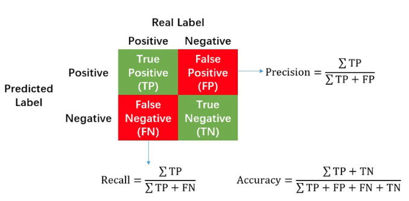

## Introdução


## Passos da aula prática


## Processamento de *raw reads* (upstream)


```{bash, eval = FALSE}
sudo nextflow run epi2me-labs/wf-16s \
      --fastq 'fastq_pass/barcodes/' \
      --minimap2_by_reference   \ 
      -profile standard
```


```{bash, eval = FALSE}
sudo nextflow run epi2me-labs/wf-16s \
      --fastq 'fastq_pass/barcodes/'  \
      --minimap2_by_reference \
      --threads 10 \
      --min_len 1500 \ 
      --max_len 1700 \ 
      --min_percent_identity 90 \ 
      -profile standard
```


# Análise dos microbiomas

### Preparar a sessão de R

```{r}
library(dplyr)
library(tidyr)
library(stringr)
library(ggplot2)
library(vegan)
```


## Importação de dados

```{r}
# Importar metadados
metadata <- read.csv("./data/metadata.csv")
# Ver a tabela de metadados
View(metadata)

# Importar tabelas de abundância
abundance <- read.table("./data/abundance_table_genus.tsv", sep = "\t", header = TRUE)
# Ver a tabela de abundância
View(abundance)

# Não precisamos da coluna com os valores totais
abundance <- abundance %>% select(-total)
```

**Questão:** Os metadados estão armazenados corretamente?

```{r}
# Verificar estrutura dos metadados
str(metadata)
```

```{r}
# verificar estrutura da tabela de abundância
str(abundance)
```

### Limpeza de dados

Com base na análise anterior, vamos corrigir os metadados:

```{r}
# Mudar colunas para formato correto
metadata_clean <- metadata %>%
  mutate(Grupo = as.factor(Grupo),
         Local = as.factor(Local),
         Solo = as.factor(Solo),
         Latitude = as.double(Latitude),
         Longitude = as.double(Longitude),
         ID = as.factor(ID),
         Barcode = as.factor(Barcode))

# Corrigir o tipo de solo
metadata_clean <- metadata_clean %>% 
  mutate(Solo = case_when(str_detect(Solo, "Solo Floresta") ~ "Floresta",
                          str_detect(Solo, "Solo Jardim") ~ "Jardim",
                          TRUE ~ NA))

# Remover barcode05
metadata_clean <- metadata_clean %>% 
  filter(Barcode != "barcode05")
# Guardar o nome dos barcodes
barcodes <- metadata_clean$Barcode
```

## Análise exploratória inicial


```{r}
# calcular o número total de reads
total_reads <- data.frame(Total = colSums(abundance[,2:8]),
                          Barcode = metadata_clean$Barcode)
# Ver o número total de reads por amostra
total_reads %>% 
  ggplot(aes(x = Barcode, y = Total)) + 
  geom_col() + 
  theme_classic() + 
  labs(title = "Número de reads por amostra")
```

**Questão:** Justifica-se aplicar rarefação?


```{r}
# Possíveis valores para rarefação
total_reads %>% 
  ggplot(aes(x = Barcode, y = Total)) + 
  geom_col() + 
  theme_classic() + 
  labs(title = "Número de reads por amostra",
       y = "Número de reads") + 
  geom_hline(yintercept = c(min(total_reads$Total), 4000, 8000), colour = c("red", "black", "black"))
```

### Opcional -- aplicar rarefação dos dados

Para aplicar rarefação, podemos usar a package "vegan", mas precisamos de transformar a data.frame numa matrix, com os grupos taxonómicos nas colunas e os barcodes nas linhas.

```{r}
# Transformar tabela em matriz com taxa nas colunas
abundance_matrix <- t(abundance[, 2:8])
colnames(abundance_matrix) <- abundance[, 1]
# Aplicar rarefação
abundance_rarefied <- rrarefy(abundance_matrix, sample = 3700)
#
View(abundance_rarefied)
```


Podemos verificar o que acontece depois da rarefação:
```{r}
# calcular total
total_rarefied <- data.frame(Total = rowSums(abundance_rarefied),
                             Barcode = barcodes) 
# visualizar
total_rarefied %>% 
  ggplot(aes(x = Barcode, y = Total)) + 
  geom_col() +  
  theme_classic() + 
  labs(title = "Número de reads depois de aplicar rarefação")
```


## Organização das tabelas

1. Transformar as tabelas de abundância para formato longo (em vez de *wide*).

Nota: tabela em formato longo implica que cada variável corresponde a uma coluna.


```{r}

#
abundance_long <- abundance %>% 
  pivot_longer(cols = all_of(barcodes), 
               names_to = "Barcode", 
               values_to = "Abundance")
# Inspectionar a tabela em formato longo
View(abundance_long)
```

2. Juntar os metadados

**Questão:** Como podemos unir as tabelas?

```{r}
# União de tabelas
full_table <- abundance_long %>% 
  left_join(metadata_clean, by = "Barcode")

# Inspecionar nova tabela
View(full_table)
```

# Análise de diversidade

## Limpeza dos dados

Passos a aplicar:

1. Remoção de singletons;
2. Remoção de taxa que não foram classificados

**Questão:** Que outras opções podemos considerar?

```{r}
full_table <- full_table %>%
  filter(Abundance > 1) %>% # Remover singletons
  filter(!str_detect(tax, "Unclassified")) # Remover não classificados
```


## Diversidade Alpha

```{r}
# Calcular métricas de diversidade
diversity <- full_table %>% 
  group_by(ID, Grupo, Local, Latitude, Longitude, Solo) %>% 
  summarise(richness = specnumber(Abundance),
            shannon = diversity(Abundance, index = "shannon"))
```
Nota: Para efeitos de comparação das amostras ambientais, não precisamos dos valores da mock community.

Agora, podemos comparar a diversidade entre os dois tipos de solo.

```{r}
# Gráfico de colunas - riqueza de taxa
diversity %>% 
  filter(ID != "M1") %>% 
  ggplot(aes(x = ID, y = richness, fill = Solo)) +
  geom_col() + 
  theme_classic() + 
  labs(title = "Diversidade alpha",
       y = "Número de taxa",
       x = "Amostra") + 
  scale_fill_manual(values = c("#d8b365", "#5ab4ac"))
# Gráfico de colunas - índice de shannon
diversity %>% 
  filter(ID != "M1") %>% 
  ggplot(aes(x = ID, y = shannon, fill = Solo)) +
  geom_col() + 
  theme_classic() + 
  labs(title = "Diversidade alpha",
       y = "Número de taxa",
       x = "Amostra") + 
  scale_fill_manual(values = c("#d8b365", "#5ab4ac"))
```

```{r}
# Gráfico de pontos - riqueza de espécies
diversity %>% 
  filter(ID != "M1") %>% 
  ggplot(aes(x = Solo, y = richness)) +
  geom_point() + 
  theme_classic() + 
  labs(title = "Diversidade alpha",
       y = "Número de taxa",
       x = "Amostra") 
```

```{r}
# Gráfico de pontos - índice de shannon
diversity %>% 
  filter(ID != "M1") %>% 
  ggplot(aes(x = Solo, y = shannon)) +
  geom_point() + 
  theme_classic() + 
  labs(title = "Diversidade alpha",
       y = "Shannon",
       x = "Amostra") 
```

### Extra - como juntar as duas métricas num só gráfico?


```{r}
# transformar em formato longo (1 coluna por variável)
diversity_long <- diversity %>% 
  filter(ID != "M1") %>% 
  pivot_longer(cols = c("richness", "shannon"),
               values_to = "Valor",
               names_to = "Metric")
# visualizar
diversity_long %>% 
  ggplot(aes(x = Solo, y = Valor)) + 
  geom_point() + 
  facet_wrap(~Metric, scales = "free_y")
```


## Qual foi o solo mais diverso?

Não temos amostras suficientes para fazer tratamento estatístico. No entanto, tipicamente, poderíamos comparar métricas de centralidade:

**Questão:* Que métricas poderíamos adicionar?

```{r}
diversity %>% 
  filter(ID != "M1") %>% 
  ungroup() %>%  
  group_by(Solo) %>% 
  summarise(mean_richness = mean(richness),
            sd_richness = sd(richness),
            mean_shannon = mean(shannon),
            sd_shannon = sd(shannon))
```

**Questão:** Qual foi o solo com maior diversidade?


### Análises adicionais

Como é que a diversidade varia em termos de coordenadas?


```{r}
# Latitude
diversity_long %>% 
  ggplot(aes(x = Latitude, y = Valor, fill = Solo)) + 
  geom_col() +
  facet_wrap(~Metric, scales = "free_y") + 
  scale_fill_manual(values = c("#d8b365", "#5ab4ac"))
# Longitude
diversity_long %>% 
  ggplot(aes(x = Longitude, y = Valor, fill = Solo)) + 
  geom_col() +
  facet_wrap(~Metric, scales = "free_y") + 
  scale_fill_manual(values = c("#d8b365", "#5ab4ac"))
```

```{r}
diversity_long %>% 
  ggplot(aes(x = Grupo, y = Valor, fill = Solo)) + 
  geom_col() +
  facet_wrap(~Metric, scales = "free_y") + 
  scale_fill_manual(values = c("#d8b365", "#5ab4ac"))
```


## Diversidade beta

Como é que a composição diferente entre tipos de solo?

Para aplicar diversidade beta precisamos de transformar a tabela numa matriz com taxa nas colunas.


```{r}
# Obter matrix nova
nova_matriz <- full_table %>%
  filter(ID != "M1") %>% 
  select(ID, Abundance, tax) %>% 
  pivot_wider(names_from = "tax",
              values_from = "Abundance",
              values_fill = 0) %>% 
  select(-ID) %>% # Remover ID da data.frame para a podermos transformar em matriz
  as.matrix()
# Adicionar nome das linhas
rownames(nova_matriz) <- metadata_clean$ID[1:6]

```


```{r}
# Calcular nMDS
nMDS <- metaMDS(nova_matriz)

# Preparar parâmetros para plot
nMDS_meta <- metadata_clean %>% 
  filter(ID != "M1") %>% 
  mutate(Solo_cor = ifelse(Solo == "Floresta", "#d8b365", "#5ab4ac"))
```


```{r}
# Visualizar ordenação
plot(nMDS$points,
     type = "p",
     xlab = "nMDS1",
     ylab = "nMDS2")
points(nMDS,
       bg = nMDS_meta$Solo_cor,
       pch = 21,
       col = "grey", 
       cex = 1.5)
```

**Questão:** Desapareceu um ponto?

```{r}
nMDS$points
```

As amostras SF2 e SF3 obtiveram resultados praticamente iguais em termos de composição da comunidade.


Opções adicionais:

- Podemos, adicionalmente, testar outros métodos de redução de dimensionalidade e de ordenação para verificar se a composição das comunidades é consistente entre métodos. 

- Na mesma ordenação que fizemos, podemos clarificar diferenças ao ilustrar os centroides dos clusters:

```{r}
# Visualizar ordenação
plot(nMDS$points,
     type = "p",
     xlab = "nMDS1",
     ylab = "nMDS2", 
     xlim = c(-0.3, 0.8),
     ylim = c(-0.1, 0.15))
points(nMDS,
       bg = nMDS_meta$Solo_cor,
       pch = 21,
       col = "grey", 
       cex = 1.5)
with(nMDS_meta,
     ordiellipse(nMDS, Solo))
```

## Análise taxonómica


```{r}
# Processamento adicional
full_table_taxa <- full_table %>% 
  # Obter uma coluna para cada nível taxonómico
  separate(col = tax,  
           sep = ";",
           into = c("Domain", "SuperKingdom", "Phylum", "Class", "Order", "Family", "Genus")) %>% 
  # Obter abundância relativa
  group_by(ID) %>% 
  mutate(relAbundance = Abundance*100/sum(Abundance))

# Cores adicionais
cores <- c("#E69F00", "#56B4E9", "#009E73", "#F0E442", "#0072B2", "#D55E00", "#CC79A7")
```


```{r}
# Nível de super Kingdom
full_table_taxa %>%
  filter(ID != "M1") %>% 
  ggplot(aes(ID, relAbundance, fill = SuperKingdom)) + 
  geom_col() + 
  scale_fill_manual(values = cores) + 
  theme_classic() + 
  labs(title = "Abundância relativa - Super Kingdom",
       y = "Relative abundance (%)",
       x = "Amostra") + 
  facet_wrap(~Solo, scale = "free_x")
```


Para analisar níveis taxonómicos mais baixos, precisamos de selecionar os grupos principais primeiro.

```{r}
top5_phyla <- full_table_taxa %>% 
  group_by(Phylum) %>% 
  summarise(total = sum(Abundance)) %>% 
  arrange(desc(total)) %>% 
  pull(Phylum)
top5_phyla <- top5_phyla[1:5]
```


```{r}
# Nível de filo
full_table_taxa %>% 
  filter(ID != "M1") %>% 
  mutate(top5_p = ifelse(Phylum %in% top5_phyla, Phylum, "Other")) %>% # Criar coluna com top 5
  mutate(top5_p = factor(top5_p, levels = c(top5_phyla, "Other"))) %>% # re-ordenar o top5
  ggplot(aes(ID, relAbundance, fill = top5_p)) + 
  geom_col() + 
  scale_fill_manual(values = c(cores[1:5], "grey50")) + 
  theme_classic() + 
  labs(title = "Abundância relativa - Phylum",
       y = "Relative abundance (%)",
       x = "Amostra",
       fill = "Top 5 phyla: ") + 
  facet_wrap(~Solo, scale = "free_x") + 
  theme(legend.position = "top")
```


**Questão:** Será que a níveis mais baixos há diferenças?

```{r}
# Nível de género
top5_genus <- full_table_taxa %>% 
  group_by(Genus) %>% 
  summarise(total = sum(Abundance)) %>% 
  arrange(desc(total)) %>% 
  pull(Genus)
top5_genus <- top5_genus[1:5]
#
full_table_taxa %>% 
  filter(ID != "M1") %>% 
  mutate(top5_g = ifelse(Genus %in% top5_genus, Genus, "Other")) %>% # Criar coluna com top 5
  mutate(top5_g = factor(top5_g, levels = c(top5_genus, "Other"))) %>% # re-ordenar o top5
  ggplot(aes(ID, relAbundance, fill = top5_g)) + 
  geom_col() + 
  scale_fill_manual(values = c(cores[1:3], "grey50")) + 
  theme_classic() + 
  labs(title = "Abundância relativa - Género",
       y = "Relative abundance (%)",
       x = "Amostra",
       fill = "Top 5 phyla: ") + 
  facet_wrap(~Solo, scale = "free_x") + 
  theme(legend.position = "top")
```


## Análise das mock communities


```{r}
# Importar dados dos isolados na mock community
mc <- read.csv("./data/mock_community.csv", header = TRUE)
```

Vamos começar por comparar os filos esperados vs os que encontrámos:

```{r}
# filos na mock community
mc_filos <- unique(mc$Phylum)

# filos identificados
seq_filos <- full_table_taxa %>% 
  filter(ID == "M1") %>%
  arrange(Phylum) %>% 
  pull(Phylum) %>% 
  unique()

# Criar tabela real vs observed
check_phylum <- data.frame(real = mc_filos,
                           observed = seq_filos)
check_phylum
```

Os filos encontrados foram os esperados, mas e ao nível do género?


```{r}
# Nível do género
mc_genus <- data.frame(Genus = unique(mc$Género))
mc_genus
#
seq_genus <- full_table_taxa %>% 
  filter(ID == "M1") %>%
  ungroup() %>% 
  arrange(Genus) %>% 
  select(Genus) %>% 
  distinct()
seq_genus
```


### Como poderemos calcular a accuracy? (Bónus - opcional)

Para esse feito, teremos de contar quantas classificações foram:
  - TP (True Positive);
  - TN (True Negative); -- não se vai aplicar
  - FP (False Positive);
  - FN (False Negative).
  
Se quisermos calcular accuracy:

$$Accuracy = \frac{TP + TN}{TP + TN + FP + FN}$$




```{r}
# TP
seq_genus %>% filter(Genus %in% mc_genus$Genus)

# FP
seq_genus %>% filter(!Genus %in% mc_genus$Genus)

# FN
mc_genus %>% filter(!Genus %in% seq_genus$Genus)
```

**Questão:** Qual foi a accuracy ao nível do género?


```{r}
accuracy = 4 / (6+3)
accuracy
```

**Bónus:** Qual foi o valor de precision e recall?

